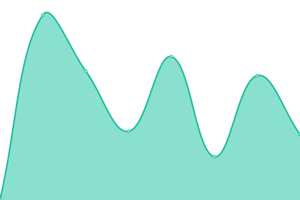
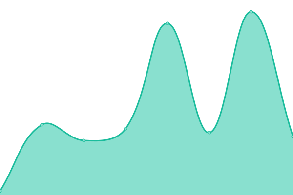
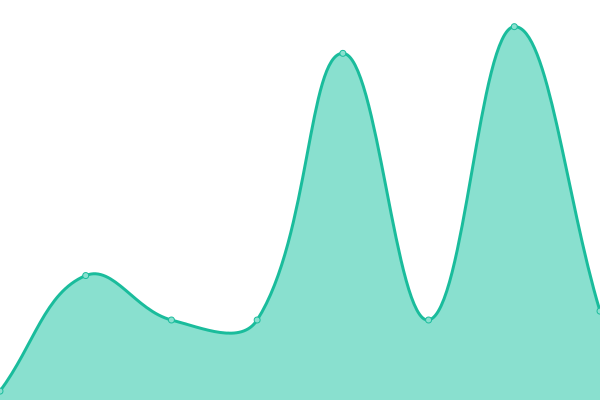
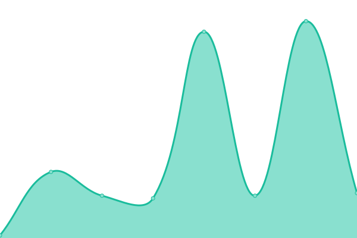

# [📈 Live Status](https://iarzaut.github.io/sc-status): <!--live status--> **🟩 All systems operational**

This repository contains the open-source uptime monitor and status page for [iarzaut](https://iarzaut.github.io/sc-status), powered by [Upptime](https://github.com/upptime/upptime).

With [Upptime](https://upptime.js.org), you can get your own unlimited and free uptime monitor and status page, powered entirely by a GitHub repository. We use [Issues](https://github.com/iarzaut/sc-status/issues) as incident reports, [Actions](https://github.com/iarzaut/sc-status/actions) as uptime monitors, and [Pages](https://iarzaut.github.io/sc-status) for the status page.

<!--start: status pages-->
<!-- This summary is generated by Upptime (https://github.com/upptime/upptime) -->
<!-- Do not edit this manually, your changes will be overwritten -->
<!-- prettier-ignore -->
| URL | Status | History | Response Time | Uptime |
| --- | ------ | ------- | ------------- | ------ |
|  Ventas | 🟩 Up | [ventas.yml](https://github.com/iarzaut/sc-status/commits/HEAD/history/ventas.yml) | 

 330ms
     
 | 

<a href="https://iarzaut.github.io/sc-status/history/ventas">100.00%</a>
    

|  Account Service | 🟩 Up | [account-service.yml](https://github.com/iarzaut/sc-status/commits/HEAD/history/account-service.yml) | 

 210ms
     
 | 

<a href="https://iarzaut.github.io/sc-status/history/account-service">100.00%</a>
    

|  Product Service | 🟩 Up | [product-service.yml](https://github.com/iarzaut/sc-status/commits/HEAD/history/product-service.yml) | 

 17ms
     
 | 

<a href="https://iarzaut.github.io/sc-status/history/product-service">100.00%</a>
    

|  Order Service | 🟩 Up | [order-service.yml](https://github.com/iarzaut/sc-status/commits/HEAD/history/order-service.yml) | 

 10ms
     
 | 

<a href="https://iarzaut.github.io/sc-status/history/order-service">100.00%</a>
    

|  Data Service | 🟩 Up | [data-service.yml](https://github.com/iarzaut/sc-status/commits/HEAD/history/data-service.yml) | 

 18ms
     
 | 

<a href="https://iarzaut.github.io/sc-status/history/data-service">100.00%</a>
    

<!--end: status pages-->

[**Visit our status website →**](https://iarzaut.github.io/sc-status)

## 📄 License

- Powered by: [Upptime](https://github.com/upptime/upptime)
- Code: [MIT](./LICENSE) © [iarzaut](https://iarzaut.github.io/sc-status)
- Data in the `./history` directory: [Open Database License](https://opendatacommons.org/licenses/odbl/1-0/)
